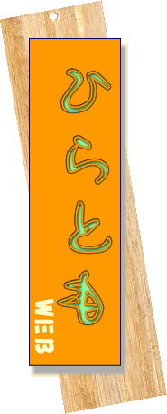
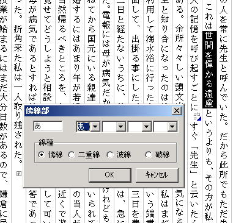
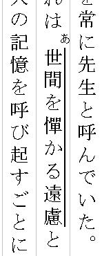
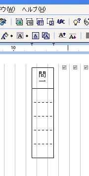

<!-- Anchor.js icon and toggle: set window.SITE_ANCHORS_ENABLED = false to disable anchors -->

# ひらとものフリーソフト

20年以上にわたってniftyのホームページで紹介してきた、自作アプリですが、今回niftyのホームページサービスが改編、私の使ってきたサービスもなくなってしまいますので、こちらで、引き続き紹介させていただきます。

プログラミングは、小学生の頃のファミリーベーシックから始め、CASIOのポケットコンピュータ、Borland Delphi、一太郎マクロ、Excel VBA、携帯電話のimode用のC言語などを勉強してきました。最近では統計用のR言語や、教科「情報」のティーチングアシスタントに入ったことをきっかけに、pythonも使うようになりました。Katsuyo Questは元はpythonで書きましたが、Webで動くようにJavaScriptに移植しています。

ちょっとしたプログラムばかりですが、何かのお役に立てたら、嬉しいです。

# 古典の学習

[Kastuyo Quest](https://www.notion.so/Kastuyo-Quest-27587c048b1b804aac6df232b63000ef?pvs=21)

用言の活用が覚えられなくて、困っている高校生のために、ゲーム形式で動詞・形容詞の活用をトレーニングします。上のリンクから紹介ページに行きます。インストール不要のWebアプリです。

# 校務に便利なアプリ

## 縦書き張り紙PDF作成

ずっと愛用している[かくかいさんの「用紙いっぱいに印刷」](https://www.kakukai.net/kwide/kwide/kwidew.htm)にインスパイアされて作成したWebアプリです。機能はかくかいさんのものの足下にも及びませんが、インストール不要なので、アプリを自由にインストールできない学校なのでは便利なのではと思います。
「議長」とか「会長」などといった張り紙を作るために使います。PDFで出力されますので、一通り作って保存しておけばいつでも使えます。少しずつ育てていきたいアプリだと思っています。

[縦書き張り紙PDF作成](https://full-print.netlify.app)

# 国語教員のための一太郎マクロ

## **試験で傍線部を引くマクロ**

一太郎で、試験問題等を作るときに傍線部をどのように作られているでしょうか。このマクロを使うと楽ですよ。

一太郎12で作成しましたが、一太郎10ぐらいからは大丈夫だと思います。ダウンロードしたファイルを開き、導入方法に従ってインストールしてください。

さらにツールバーやショートカットキーへこのマクロを割り当ててやれば問題作成がはかどること請け合いですよ。

ダウンロード

[bosen.jtd](files/bosen.jtd)

## **字数制限付きの解答欄を簡単に作るマクロ**

国語の教員にとって解答用紙を作る作業は大変手間のかかるものです。特に字数制限をしたときには、罫線を引く時間がむやみにかかります。しかも、テスト前日ともなれば、いらいらが募ります。

下のキャプチャをみてください。このマクロを使えば、問一の後にある５文字分の解答欄が３秒でできあがります。是非試してみてください。

ダウンロードしたファイルを開き、導入方法に従ってインストールしてください。

ただ罫線モード（通常・全角）で解答用紙を作ることが前提となっています。これは私の好みです。１ページの行数が少ないときは、改行幅を1/2等狭くすると見栄えが良くなります。

ダウンロード

[jisukaito.jtd](files/jisukaito.jtd)

## **漢文訓点入力マクロ**

某出版社の教師用資料にも添付されているマクロです。とにかく訓点を素早く楽に付けることができます。教科書のように縦横漢字が揃うというようなことはできませんが…。

### **漢文の返り点を簡単につけるマクロ**

国語の教員にとって漢文ほどやっかいなものはありません。

右のキャプチャをみてください。このマクロを使えば、キャプチャにあるようなきれいな返り点が数秒でできあがります。是非試してみてください。大阪の藤田さんによって踊り字が追加されました！（2003-12-1）

### **漢文の送りがなを簡単につけるマクロ（返読文字に対応！！）**

漢文シリーズ第２弾です。

右のキャプチャをみてください。このマクロを使えば、このような送りがなが、ものの数秒でできあがります。返読文字に対応していないのが、残念ですが、それはまたいつか。一太郎のふりがな機能を使っています。仕組みがわかれば「なあんだ」と言われてしまいそうです。使ってみてください。

このマクロはVectorで公開しています。

[漢文訓点入力マクロ 一太郎版の詳細情報 : Vector ソフトを探す！](https://www.vector.co.jp/soft/win95/writing/se440375.html)

# 図書館管理システム

## 文籍(MonJack)

図書館管理システム「文籍(MonJack)」は長年にわたり、学校や海外日本人学校、研究室などで利用していただいています。坂田算浩さんと一緒に作りました。費用がなくて電算化をためらう多くの図書館で、電算化をすすめるきっかけにしていただいたようです。

[図書館管理システム文籍(MonJack)](https://tom-hirabayashi.github.io/MonJackHP/)

# その他Vectorで公開されているソフトを御覧ください

[作者: 平林 朋之](https://www.vector.co.jp/vpack/browse/person/an036268.html)

---

$\footnotesize\textit {© 2025 Tomoyuki.Hirabayashi All right reserved.}$