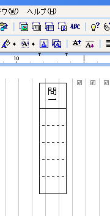

国語の教員にとって、解答用紙作成は手間のかかる作業です。特に字数制限付きの解答欄は、罫線を引く時間が多くかかります。

このマクロを使えば、例えば問一の後にある5文字分の解答欄を短時間で作成できます。ダウンロードしたファイルを開き、導入方法に従ってインストールしてください。

罫線モード（通常・全角）で解答用紙を作ることを前提にしています。1ページの行数が少ないときは、改行幅を1/2等に狭くすると見栄えが良くなります。

