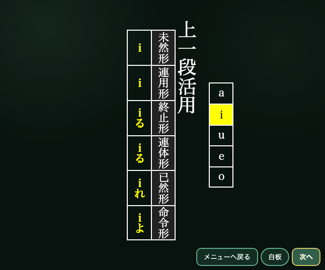
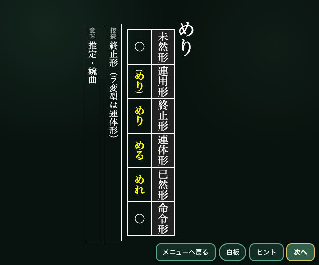

古典文法の活用を、黒板やプロジェクター、あるいは生徒の手元の電子端末に表示しながら繰り返し練習するWebアプリです。

動詞・形容詞・形容動詞の活用に加えて、例外動詞の暗記、助動詞の活用・意味・接続まで練習できます。授業で全員に問いかける場面にも、一人で知識を確かめる場面にも使えるようにしました。

## 2つの練習モード

「周回モード」では、選んだ範囲から問題をランダムに一周ずつ出題します。テンポよく繰り返し、活用や接続を確認したいときに向いています。

「習得モード」では、解答を確認したあとに自分で○×を付けます。間違えた問題は再び出題され、全問正解するまで練習を続けられます。

## 練習できる内容

- 動詞のみ、または用言全体の活用
- 上一段・下一段・変格活用などの例外動詞
- 助動詞の活用表
- 助動詞の意味
- 助動詞の接続

助動詞は出題したいものだけに絞り込めます。選択状態を含んだURLもコピーできるため、授業で扱う助動詞を指定して生徒に共有することもできます。

## 授業で使いやすい表示と操作

教室で見やすい深緑の「黒板モード」と、明るい「白板モード」を切り替えられます。画面上のボタンに加えてキーボードでも操作でき、下矢印キーで解答表示、右矢印キーで次の問題へ進めます。

問題を出す、考える時間を取る、答えを見せる、次へ進む、という授業中の流れを止めずに操作できることを大切にしています。

[古典文法活用トレーナーを開く](https://katsuyo-trainer.netlify.app)
